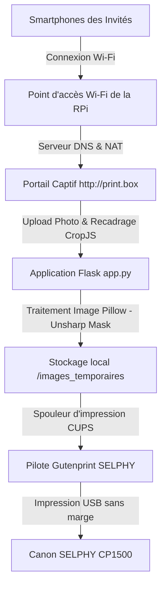

# 📘 Documentation Technique de la Borne Photo (Web-to-Print)

Cette documentation détaille l'architecture logicielle, le réseau captif, le traitement d'image et la configuration d'impression du système.

---

## 🏗️ Architecture Globale du Système

La borne d'impression est un système autonome ("captive box") composé d'une Raspberry Pi connectée à une imprimante Canon SELPHY CP1500 (via USB) et faisant office de point d'accès Wi-Fi.



---

## 📡 1. Couche Réseau & Portail Captif (Offline)

La Raspberry Pi fonctionne de manière 100% autonome sans connexion internet requise pendant l'événement.

* **Point d'accès WiFi (hostapd)** : Crée le réseau Wi-Fi ouvert nommé `Print_Box` sur le canal 7.
* **Serveur DHCP & DNS (dnsmasq)** :
  * Distribue des adresses IP aux invités sur la plage `192.168.4.10` à `192.168.4.250`.
  * Redirige toutes les requêtes de noms de domaine vers l'IP de la passerelle `192.168.4.1` (Redirection DNS universelle).
* **Portail Captif (iptables NAT)** :
  * Intercepte toutes les requêtes HTTP (port 80) et les redirige (`REDIRECT`) vers le port `8000` où tourne l'application Flask.
  * L'adresse réseau officielle de la borne est **`http://print.box`**.

---

## 🐍 2. Application Backend & API Flask (`app.py`)

L'application Flask gère le cycle de vie de la file d'attente d'impression, les quotas d'invités, et la communication avec l'imprimante :

* **Serveur Flask** : Écoute sur le port `8000` (démarré par le service systemd `webprint.service`).
* **Base de données légère (`bdd_boite.json`)** : Enregistre le nombre de tirages par appareil client (identifié par l'adresse IP et l'User-Agent) pour appliquer la limite de tirages par invité.
* **Fichier de configuration (`config_boite.json`)** : Contient les réglages modifiables à chaud depuis l'interface d'administration (`/admin` avec le code PIN `1234`) :
  * Taille maximale de la file d'attente.
  * Quota d'impressions par invité.
  * Simulation d'imprimante (mode démo hors ligne).
  * Nom de la file d'impression CUPS (par défaut `SELPHY`).
* **File d'attente (Queue)** : Les tâches d'impression reçues sont sérialisées et traitées l'une après l'autre de manière asynchrone pour éviter les conflits d'accès USB de l'imprimante.

---

## 🎨 3. Traitement d'Image & Précision (Pillow / Cropper.js)

Le pipeline graphique est optimisé pour délivrer une netteté d'impression optimale :

### A. Rendu haute résolution (Client)
Le client utilise la bibliothèque `Cropper.js` (sauvegardée localement sur la Pi pour un fonctionnement hors ligne).
* Lorsque l'invité valide sa découpe, le canvas HTML5 est rendu à une résolution de **2400 x 3600 pixels (8.6 MP)** pour un portrait ou **3600 x 2400 pixels** pour un paysage. 
* L'anti-crénelage du navigateur est activé via `imageSmoothingQuality: 'high'`.
* L'image est exportée en JPEG avec une qualité de compression de **`96%`** pour conserver une netteté maximale sans compression destructrice.

### B. Traitement de netteté en arrière-plan (Serveur RPi)
L'impression par sublimation thermique (dye-sub) applique des couches de cire chauffée qui fusionnent sur le papier, adoucissant naturellement l'image.
* Pour compenser cela, l'application utilise **Pillow** (`PIL.ImageFilter.UnsharpMask`) pour appliquer un filtre d'accentuation de netteté (masque flou) juste avant l'envoi au spouleur :
  ```python
  img = Image.open(cropped_file)
  img_sharpened = img.filter(ImageFilter.UnsharpMask(radius=2, percent=150, threshold=3))
  img_sharpened.save(ready_path, format="JPEG", quality=96)
  ```
  Ce filtre renforce le contraste des micro-détails (contours) pour obtenir une impression finale très piquée sur le papier.

### C. Ajustements colorimétriques à chaud & Prévisualisation
Pour égaler précisément le rendu coloré contrasté de l'application Canon SELPHY officielle, l'administrateur peut régler à chaud 3 coefficients colorimétriques depuis la console `/admin` :
* **Contraste** (`enhance_contrast`) : Ajuste la dynamique des tons clairs et sombres (via `PIL.ImageEnhance.Contrast`).
* **Saturation/Couleur** (`enhance_color`) : Intensifie ou atténue la vivacité des couleurs (via `PIL.ImageEnhance.Color`).
* **Luminosité** (`enhance_brightness`) : Ajuste l'exposition générale de l'image (via `PIL.ImageEnhance.Brightness`).

> [!TIP]
> **Valeurs de calibrage recommandées** (trouvées pour égaler le rendu de l'application Canon SELPHY officielle) :
> * Contraste : **`1.15`**
> * Saturation / Couleur : **`1.20`**
> * Luminosité : **`1.10`**

Ces rehaussements s'appliquent séquentiellement en Python sur le serveur avant le filtre de netteté :
```python
img = ImageEnhance.Contrast(img).enhance(contrast_factor)
img = ImageEnhance.Color(img).enhance(color_factor)
img = ImageEnhance.Brightness(img).enhance(brightness_factor)
```

**Visualiseur temps réel (Console d'administration) :**
Un visualiseur interactif est intégré sous les réglettes d'ajustement. Il permet de voir instantanément le résultat des réglages à l'aide de filtres CSS appliqués en temps réel dans le navigateur de l'administrateur (côté client). Un motif de test (mire colorée SVG) est chargé par défaut, et l'administrateur peut importer ses propres photos de test à l'aide du bouton dédié pour affiner ses réglages avant de sauvegarder.

---

## 🖨️ 4. Pipeline d'Impression & Gutenprint

### A. Détection USB automatique (Udev)
Une règle udev (`/etc/udev/rules.d/99-selphy.rules`) écoute la connexion des périphériques de Vendor ID Canon (`04a9`).
* Lors de la connexion physique, elle déclenche le script d'enregistrement automatique `/usr/local/bin/auto_add_selphy.sh`.
* Ce script détecte l'URI USB (`usb://Canon/...`) via la commande `lpinfo -v` et associe automatiquement le pilote Gutenprint approprié.

### B. Configuration de la qualité d'impression Gutenprint
Pour éliminer les marges blanches et obtenir le rendu couleur optimal, le script configure la file CUPS avec les options Gutenprint suivantes :
```bash
lpadmin -p "SELPHY" \
  -o PageSize=Postcard.Borderless \
  -o StpBorderless=True \
  -o StpiShrinkOutput=Expand \
  -o StpColorCorrection=Accurate \
  -o StpImageType=Photo \
  -o StpColorPrecision=Best
```

| Option Gutenprint | Description | Effet sur la qualité |
| :--- | :--- | :--- |
| `StpBorderless=True` | Active le mode physique sans bordure | Supprime les marges blanches latérales et verticales. |
| `StpiShrinkOutput=Expand` | Étire l'image légèrement au-delà de la zone imprimable | Garantit l'absence de liseré blanc périphérique (overspray). |
| `StpColorCorrection=Accurate` | Applique les profils de courbes Gutenprint | Évite les images plates/fades, assure des couleurs denses et contrastées. |
| `StpImageType=Photo` | Active l'algorithme de rendu à tons continus | Élimine les effets de trame de points ou de grain sur les dégradés. |
| `StpColorPrecision=Best` | Traitement colorimétrique interne en 16 bits | Offre des transitions colorées très douces et détaillées. |

---

## 🔗 Gestion des statuts et Erreurs Matérielles

Dans `app.py`, la fonction `get_printer_status_info` interroge dynamiquement l'état matériel de l'imprimante en interrogeant la commande CUPS `lpstat -p SELPHY`. 
* **Détection physique USB** : Si l'imprimante est débranchée, `lsusb` ne trouve plus la chaîne "Canon" et la borne affiche instantanément un statut "Débranchée".
* **Erreurs CUPS** : Le script extrait les messages d'état de CUPS pour isoler des mots-clés spécifiques (ex: *paper*, *empty*, *jam*, *ink*, *ribbon*). En cas de rupture de papier ou de cartouche d'encre vide, la console d'administration affiche précisément l'anomalie.
* **Reprise automatique** : La SELPHY CP1500 possède sa propre mémoire tampon. Si elle tombe en panne de papier au milieu d'un tirage, CUPS peut marquer le travail comme terminé une fois le transfert USB fait, mais l'imprimante reprendra son travail de manière autonome dès que du papier neuf sera inséré dans le bac.
