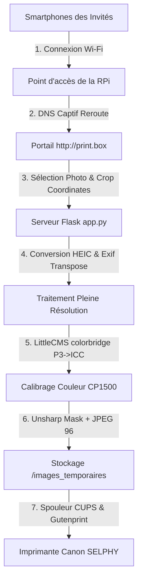

# 🖨️ WebPrint - Borne Photo Autonome (Web-to-Print)

[](https://www.python.org/)
[](https://flask.palletsprojects.com/)
[](https://python-pillow.org/)
[](LICENSE)

**WebPrint** est un système complet et autonome ("captive box") permettant de transformer une Raspberry Pi et une imprimante **Canon SELPHY CP1500** en une borne photo événementielle interactive. 

Les invités se connectent au réseau Wi-Fi local de la borne, recadrent leurs photos depuis leur smartphone via une interface web fluide et lancent l'impression sans fil en quelques secondes. Le système fonctionne **100% hors ligne (sans connexion Internet)** et applique un pipeline de traitement d'image professionnel.

---

## 🏗️ Architecture du Système



---

## ✨ Caractéristiques Principales

### 📸 Expérience Invité & Recadrage Fluide
- **Portail Captif Local** : Redirection DNS universelle redirigeant tout le trafic HTTP vers `http://print.box`.
- **Cadrage Interactif** : Intégration de `Cropper.js` pour cadrer et pivoter la photo au format de tirage physique (portrait/paysage).
- **Support HEIC / HEIF Natif** : Conversion asynchrone transparente des formats Apple HEIC sur le serveur via `pillow-heif` pour prévisualisation et recadrage.
- **Aucune surcharge mobile** : Le recadrage lourd est déporté sur le processeur de la Raspberry Pi, évitant les crashs de mémoire (OOM) fréquents sur Safari iOS.

### 🎨 Traitement d'Image Haute Précision
- **Recadrage à Pleine Résolution** : Le serveur découpe l'image d'origine non compressée à ses dimensions natives pour conserver 100% de la densité d'information.
- **Normalisation d'orientation EXIF** : Détection automatique et transposition de la rotation de l'appareil photo (`ImageOps.exif_transpose`).
- **Calibrage Colorimétrique Professionnel** : Conversion colorimétrique LittleCMS (`ImageCms`) pour faire correspondre le profil de la photo (ex: *Display P3* ou *sRGB*) avec le profil physique de l'imprimante (`ICC-Profile165-CP1500.icc`).
- **Netteté Accentuée (Unsharp Mask)** : Application d'un filtre d'accentuation de netteté pour compenser la diffusion thermique naturelle de l'impression par sublimation.
- **Réglage colorimétrique en direct** : Ajustements à chaud du contraste, de la saturation et de la luminosité depuis l'administration.

### 🛡️ Contrôle Événementiel & Quotas
- **Limitation par Appareil** : Identification réseau persistante des appareils (adresse IP/MAC et User-Agent) pour appliquer un quota maximum de tirages par invité.
- **Console d'Administration Sécurisée (`/admin`)** : Interface protégée par code PIN pour suivre la file d'attente d'impression, réinitialiser les compteurs, ajuster les paramètres et télécharger une sauvegarde.
- **Double Sauvegarde Structurée** : Export ZIP complet téléchargeable contenant deux dossiers distincts : `/originales` (fichiers bruts non altérés) et `/recadrees` (photos finales étalonnées).

---

## 🛠️ Installation & Déploiement

### Déploiement initial (depuis votre Mac vers la RPi)
Le script de déploiement automatique configure l'ensemble des dépendances système (Hostapd, Dnsmasq, CUPS, Gutenprint, Python, etc.) sur la Raspberry Pi :

```bash
chmod +x deploy_printbox.sh setup_printbox.sh
./deploy_printbox.sh "Nom_de_l_imprimante" "utilisateur" "rpi.local"
```

### Mise à jour rapide (en cours d'événement)
Pour transférer des modifications du code source ou mettre à jour les dépendances Python de la borne sans tout réinitialiser :

```bash
chmod +x update_printbox.sh
./update_printbox.sh "utilisateur" "rpi.local"
```

---

## ⚙️ Configuration du Portail Hors Ligne
* **SSID Wi-Fi** : `Print_Box` (Réseau ouvert, canal 7)
* **IP Passerelle** : `192.168.4.1`
* **Plage DHCP** : `192.168.4.10` à `192.168.4.250`
* **Redirection NAT** : Redirige le trafic HTTP (Port 80) vers le serveur Flask (Port 8000).

---

## 📝 Licence
Ce projet est distribué sous licence MIT. Voir le fichier `LICENSE` pour plus de détails.
